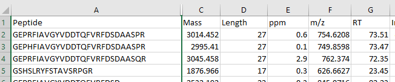

# Getting started in R and the tidyverse {#tidyverse}

## Tidy data and the tidyverse

R is a programming language, and written in R is *"an opinionated collection 
of R packages designed for data science"* called [tidyverse](https://www.tidyverse.org/) [@R-tidyverse]. 

Tidyverse packages *"share an underlying design philosophy, grammar, and data structures."* It's this philiosophy that makes them relatively easy to learn
and use.

The principals of tidy data for tabular data as proposed in the Tidy Data 
paper http://www.jstatsoft.org/v59/i10/paper are:

1. Every variable has its own column.
2. Every observation has its own row.
3. Each value has its own cell.

If our table was proteomics data then, we might have a set of variables such 
as the peptide sequence, mass or length observed for a number of peptides.
Therefore each peptide would have a row with columns for peptide sequence, mass and length with the value for each variable in separate cells, as
seen in Figure \@ref(fig:tidy-prot).

(ref:tidy-prot) An example of tidy proteomics data

```{r tidy-prot, fig.cap='(ref:tidy-prot)',fig.asp=1, out.width= '80%', fig.align='center', echo=FALSE}

```

We can't do everything in the tidyverse, and everything we can do in the 
tidyverse can be done in what is called base R or other packages, but the 
motivation behind the tidyverse is to ease the pain of data manipulation.

With this in mind, the two tasks we are most likely to want to do 
in data science are:

1. Visualise our data
2. Automate our processes.

Taking our cue from [R4DS](http://r4ds.had.co.nz/) let's try an example.

## Data visualisation

Let's begin with visualisation of some data using the `ggplot2` package,
which implements the *grammer of graphics*, for describing
and building graphs.

The motivation here is twofold: to begin to grasp the grammar of graphics
approach to creating plots, and most importantly to demonstrate how 
plotting is often the most useful thing we can do when trying to understand
what is going on.

We'll use the `mpg` dataset that comes with the tidyverse to examine
the question *do cars with big engines use more fuel than cars with small engines?*

Try `?mpg` to learn more about the data.

1. Engine size in litres is in the `displ` column.
2. Fuel efficiency on the highway in miles per gallon is given in the `hwy` column.

To create a plot of engine size `displ` (x-axis) against fuel efficiency `hwy` (y-axis)  we do the following:

1. Use the `ggplot()` function to create an empty graph.
2. We give ggplot a first argument of the data (here `mpg`). 
3. Then we follow the ggplot function with a `+` sign to indicate
we are going to add more coed, followed by a `geom_point()` function to add a layer of points mapping some aesthetics for the x and y axes.
4. Mapping is always paired to aesthetics `aes()`. An aesthetic is a visual property of the objects in your plot, such a point size, shape or point colour.

Therefore to plot engine size (x-axis) against fuel efficiency (y-axis) we 
use the following code:

```{r mpg-plot-1,mpg_point_plot}
ggplot(data = mpg) + 
  geom_point(mapping = aes(x = displ, y = hwy))
```

This plot shows a negative relationship between engine size and fuel 
efficiency.

Now try extending this code to include to add a `colour` aesthetic to the
the `aes()` function, let `colour = class`, `class` being the veichle type.
This should create a plot with as before but with the points coloured
according to the viechle type to expand our understanding.

```{r, mpg-plot-2}
ggplot(data = mpg) + 
  geom_point(mapping = aes(x = displ, y = hwy, colour = class))
```

Now we can see that as we might expect, bigger cars such as SUVs tend to have 
bigger engines and are also less fuel efficient, but some smaller cars such as 
2-seaters also have big engines and greater fuel efficiency. Hence we have a 
more nuanced view with this additional aesthetic.

Check out the ggplot2 documentation for all the aesthetic possibilities (and 
Google for examples): http://ggplot2.tidyverse.org/reference/

So now we have re-usable code snippet for generating plots in R:

```{r, purl=FALSE,eval=FALSE}
ggplot(data = <DATA>) + 
  <GEOM_FUNCTION>(mapping = aes(<MAPPINGS>))
```

Concretely, in our first example `<DATA>` was `mpg`, the `<GEOM_FUNCTION>` 
was `geom_point()` and the arguments we supplies to map our aesthetics 
`<MAPPINGS>` were `x = displ, y = hwy`.

Hopefully you are beginning to see how a single line of code can do a lot with
tidy data.

## Workflow basics

Let's run through the basics of working in R to conclude this chapter.

### Assigning objects

Objects are just a way to store data inside the R environment. We create objects using the assignment operator `<-`:

```{r mass-kg}
mass_kg <- 55
```

Read this as *"mass_kg gets value 55"* in your head.

Using `<-` can be annoying to type, so use RStudio’s keyboard short cut: 
Alt + - (the minus sign) to make life easier. 

Object name style is a matter of choice, but must start with a letter and can 
only contain letters, numbers, `_` and `.`. We recommend using descriptive names
and using `_` between words. Some special symbols cannot be used in variable 
names, so watch out for those.

So here we've used the name to indicate its value represents a mass in kilograms. Look in your environment pane and you'll see the `mass_kg` object containing the (data) value 55.

We can inspect an object by typing it's name:

```{r mass-inspect}
mass_kg
```

What's wrong here?

```{r mass-wrong-name, eval=FALSE}
mass_KG
```
`Error: object 'mass_KG' not found`

This error illustrates that typos matter, everything must be precise and `mass_KG`
is not the same as `mass_kg`. `mass_KG` doesn't exist, hence the error.

### Calling functions

Functions in R are objects followed by parentheses, such as `library()`. 
Functions have the form:

`function_name(arg1 = val, arg2 = val2, ...)`

Let's use `seq()` to create a **seq**uence of numbers, and at the same time practice tab completion.

Start typing `se` in the console and you should see a list of functions appear,
add `q` to shorten the list, then use the up and down arrow to highlight the function
of interest `seq()` and hit Tab to select.

RStudio puts the cursor between the parentheses to prompt us to enter some 
arguments. Here we'll use 1 as the start and 10 as the end:

```{r sequence-function}
seq(1,10)
```

If we left off a parentheses to close the function, then when we hit enter 
we'll see a `+` indicating RStudio is expecting further code. We either add the 
missing part or press Escape to cancel the code.

Let's call a function and make an assignment at the same time. Here we'll use
the base R function `seq()` which takes three arguments: `from`, `to` and `by`.

Read the following code as *"make an object called my_sequence that stores a sequence of numbers from 2 to 20 by intervals of 2*.

```{r sequence-object}
my_sequence <- seq(2,20,2)
```

This time nothing was returned to the console, but we now have an object called
`my_sequence` in our environment.

Can you remember how to inspect it?

If we want to subset elements of `my_sequence` we use 
square brackets `[]`.

For example element five would be subset by:

```{r sequence-element}
my_sequence[5]
```

Here the number five is the index of the vector, not the value of the fifth element. The value of the fifth element is 10. 

And returning multiple elements uses a colon `:`, like so

```{r sequence-range}
my_sequence[5:8]
```

### Atomic vectors

We actually made an atomic vector already when we made `my_sequence`. We made a
a one dimensional group of numbers, in a sequence from two to twenty.

We're not going to be working much with atomic vectors in this workshop, 
but to make you aware of how R stores data, atomic vector types 
are: 

+ Doubles: regular numbers, +ve or -ve and with or without decimal places. AKA numerics.
+ Integers: whole numbers, specified with an upper-case L, e.g. `int <- 2L`
+ Characters: Strings of text
+ Logicals: these store `TRUE`s and `FALSE`s which are useful for comparisons.
+ Complex: this would be a vector of numbers with imaginary terms. 
+ Raw: these vectors store raw bytes of data.

Let's make a character vector and check the type:

```{r cards-characters}
cards <- c("ace", "king", "queen", "jack", "ten")

cards

typeof(cards)
```

### Attributes 

An attribute is a piece of information you can attach to an object, such as
names or dimensions. Attributes such as dimensions are added when 
we create an object, but others such as names can be added.

Let's look at the `mpg` data frame dimensions:

```{r attributes}
# mpg has 234 rows (observations) and 11 columns (variables)
dim(mpg)
```

### Factors

Factors are Rs way of storing categorical information such as eye colour or
car type. A factor is something that can only have certain values, and can be
ordered (such as `low`,`medium`,`high`) or unordered such as types of fruit.

Factors are useful as they code string variables such as "red" or "blue" to integer values e.g. 1 and 2, which can be used in statistical models and when plotting, but they are confusing as they look like strings. 

**Factors look like strings, but behave like integers.**

Historically R converts strings to factors when we load and create data, but 
it's often not what we want as a default. Fortunately, in the tidyverse strings
are not treated as factors by default.

### Lists

Lists also group data into one dimensional sets of data. The difference being 
that list group objects instead of individual values, such as several atomic 
vectors.

For example, let's make a list containing a vector of numbers and a character
vector

```{r list-example}
list_1 <- list(1:110,"R")

list_1
```

Note the double brackets to indicate the list elements, i.e. element one is the
vector of numbers and element two is a vector of a single character.

We won't be working with lists in this workshop, but they are a flexible way to 
store data of different types in R. 

Accessing list elements uses double square brackets syntax, for example
`list_1[[1]]` would return the first vector in our list. 

And to access the first element in the first vector would combine double and
single square brackets like so: `list_1[[1]][1]`.

Don't worry if you find this confusing, everyone does when they first start with
R.

### Matrices and arrays

Matrices store values in a two dimensional array, whilst arrays can have n 
dimensions. We won't be using these either, but they are also valid R objects.

### Data frames

Data frames are two dimensional versions of lists, and this is form of storing
data we are going to be using. In a data frame each atomic vector type becomes
a column, and a data frame is formed by columns of vectors of the same length.
Each column element must be of the same type, but the column types can vary.

Figure \@ref(fig:df) shows an example data frame we'll refer to as
saved as the object `df` consisting of three rows and three columns. Each 
column is a different atomic data type of the same length.

(ref:df) An example data frame `df`.


```{r df,fig.cap='(ref:df)', fig.asp=1, out.width= '80%', fig.align='center', echo=FALSE}
knitr::include_graphics("img/data_frame.png")
```

Packages in the  tidyverse create a modified form of data frame called a tibble.
You can read about tibbles [here](http://r4ds.had.co.nz/tibbles.html). One 
advantage of tibbles is that they don't default to treating strings as factors. 
We deal with modifying data frames when we work with our example data set.

Sub-setting data frames can also be done with square bracket syntax, but as we
have both rows and columns, we need to provide index values for both row and 
column.

For example `df[1,2]` means **return the value of `df` row 1, column 2**. This corresponds with the value `A`. 

We can also use the colon operator to choose
several rows or columns, and by leaving the row or column blank we return all 
rows or all columns.

```{r subset-df, eval=FALSE}
# Subset rows 1 and 2 of column 1
df[1:2,1]

# Subset all rows of column 3
df[,3]
```

Again don't worry too much about this for now, we won't be doing to much of this
in this lesson, but it's important to be aware of the basic syntax.

## Learning more R

There are many places to start, but swirl can teach you interactively, and at your own pace in RStudio.

Just follow the instructions via this link: http://swirlstats.com/students.html

*Hands-On Programming with R* by Garrett Grolemund is another great resource 
for learning R.

Plus all the [tidyverse links](https://www.tidyverse.org/learn/).
