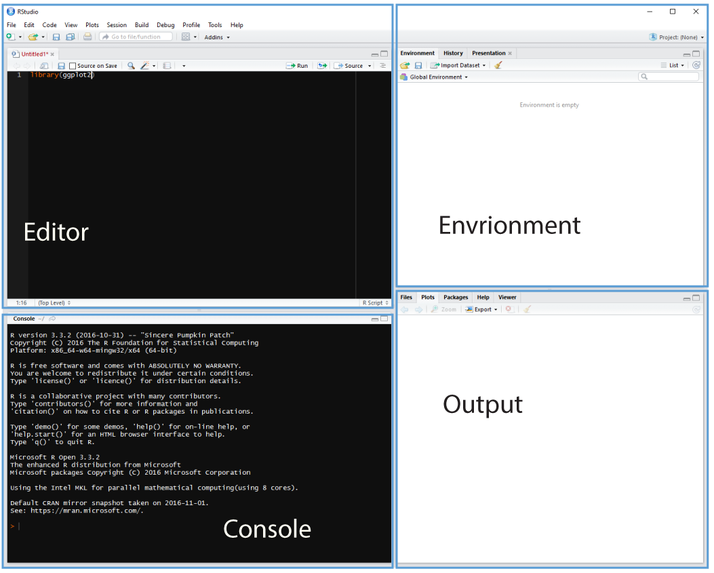
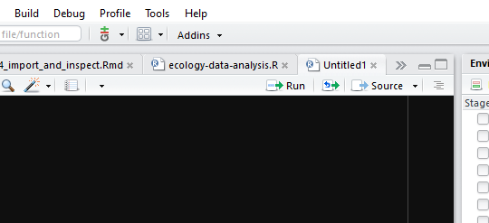

# Creating scripts and importing data {#import}

Our analysis is of an example data set of observations for 7702 proteins
from cells in three control experiments and three treatment experiments.
The observations are signal intensity measurements from the mass spectrometer.
These intensities relate to the amount of protein in each experiment and under 
each condition.

We consider raw data as the data as we receive it. This doesn't mean it hasn't be
processed in some way, it just means it hasn't been processed by us.
Generally speaking we don't change the raw data file, what we do is import it and
create an object in R which we then transform.

So let's understand how to import some data.

## Some definitions

 + Importing means getting data into our R environment by turning into into a
 R object that we can then manipulate. The raw data file remains unchanged.
 + Inspecting means looking at the dataset to understand what it contains.
 + Tidying refers to getting data into a consistent format that makes it easy to
 use in later steps.
 
 A note here is that we are focusing on rectangular data, the sort that comes
 in rows and columns such as in a spreadsheet. Lots of our data types exist,
 such as images, which are beyond the scope of this lesson, but can also be
 handled by R.
 
## Using scripts

Using the console is useful, but as we build up a workflow, that is to say,
wring code to:

+ load packages 
+ load data
+ explore the data 
+ and output some results

Then it's much more useful to contain this in a script: a document of our code.

Why? When we write and save our code in scripts, we can re-use it, share it or 
edit it. But **most importantly a script is a record**.

Cmd/Ctrl + Shift + N will open a new script file up and you should see something
like Figure \@ref(fig:script-pane) with the script editor pane open:

(ref:script-pane) Rstudio with the script editor pane open.

```{r script-pane, fig.cap = '(ref:script-pane)', fig.asp=1, out.width= '80%', fig.align='center', echo=FALSE}

```

## Running code

We can run a highlighted portion of code in your script if you click the Run
button at the top of the scripts pane as shown in Figure \@ref(fig:run-script). 

(ref:run-script)

```{r run-script, fig.cap= '(ref:run-script)',fig.asp=1, out.width= '80%', fig.align='center', echo=FALSE}

```

You can run the entire script by clicking the Source button.

Or we can run chunks of code if we split our script into sections, see below.

## Creating a R script

We first need to create a script that will form the basis of our analysis.

Go to the file menu and select New Files > R script. This should open the script
editor pane.

Now let's save the script, by going to File > Save and we should find ourselves
prompted to save the script in our Project Directory.

Following the advice about [naming things](#names) we can create a new R script
called `01-bspr-workshop-july-2018`.

This name is machine readable (no spaces or special characters), human readable,
and works well with default ordering by beginning with `01`.

## Setting up our environment

At the head of our script it's common to put a title, the name of the author
and the date, and any other useful information. This is created as comments 
using the `#` at the start of each line.

It's then usual to follow this by code to load the packages we need into our
our R environment using the `library()` function and providing the name of the
package we wish to load. Packages are collections of R functions.

Often we break the code up into regions by adding dashes (or equals symbols) 
to the comment line. This enables us to run chunks of the script separately from
running the whole script when using our code.

Here is a typical head for a script:

```{r set-up, eval=FALSE}
# My workshop script
# 7th July 2018
# Alistair Bailey

# Load packages ----------------------------------------------------------------
library(tidyverse)
library(gplots)
library(pheatmap)
```

### Bioconductor

As an aside there are many proteomics specific R packages, these are generally
found through [Bioconductor](https://www.bioconductor.org/) which is a project
that was initiated in 2001 to create tools for the analysis of high-throughput 
genomic data, but also includes other 'omics data tools [@gentleman2004,@huber2015].

Exploring Bioconductor is beyond our scope here, but well worth exploring for
manipulation and analysis of raw data formats such as mzxml files.

## Importing data

Assuming our data is in a flat format, we can import it into our environment
using the tidyverse `readr` package. A flat format is a file that contains only
text  such as `csv` or tab separated data without meta-data (extra information), 
such as the colour of cells in an excel file. 

If we our data was an excel file, we can use the tidyverse `readxl` package to 
import the data.

For the purposes of this workshop we have a `csv` (comma separated variable) file.

If you haven't done so already
<a href="https://raw.githubusercontent.com/ab604/ab604.github.io/master/docs/070718-proteomics-example-data.csv" download>Click here to download</a> the example data and save it to our project 
directory. Check the `Files` pane to see it's there.

We then import data and assign it to an object we'll call `data` like so:

```{r example-data, echo=FALSE, eval=F,cache=T}
# Charlotte's data
dat <- read_csv("data/MergedFinalProt_2colPerFile_12files_filtered_ch.csv",
                   na = "NaN", col_types = cols()) %>% clean_names()

# Clean it up for workshop, keep missing values
dat_select <- dat %>%
#   # Select and rename columns
  select(protein_accession = protein_entry_protein_accession,
         protein_description,
         control_1 = c1,
         control_2 = c2,
         control_3 = c3,
         treatment_1 = rt1,
         treatment_2 = rt2,
         treatment_3 = rt3)

# Write out the example data
write_csv(dat_select,"data/070718-proteomics-example-data.csv")
```

```{r import-data, eval=TRUE, cache=F}
# Import example data ----------------------------------------------------------
# Import the example data with read_csv from the readr package
dat <- readr::read_csv("data/070718-proteomics-example-data.csv")
```

## Exploring the data

The first thing to do with any data set is to actually look at it. Here are
three ways to have look in the `Console`: 

```{r examine-data}
# call object
dat

# tidyverse glimpse function
glimpse(dat)

# head function
head(dat)

# str function
str(dat)
```

To see the data in a *spreadsheet* fashion use `View(dat)`, note the capital V
and a new tab will open. This can also be launched from the `Environment` tab by
clicking on `dat`.

Although this provides us with some useful information, such as the number of
observations and variables, to understand more plotting the data will be
helpful as we'll see in Section [#normalisation].
