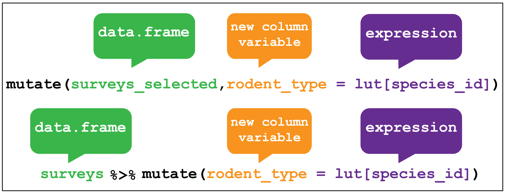
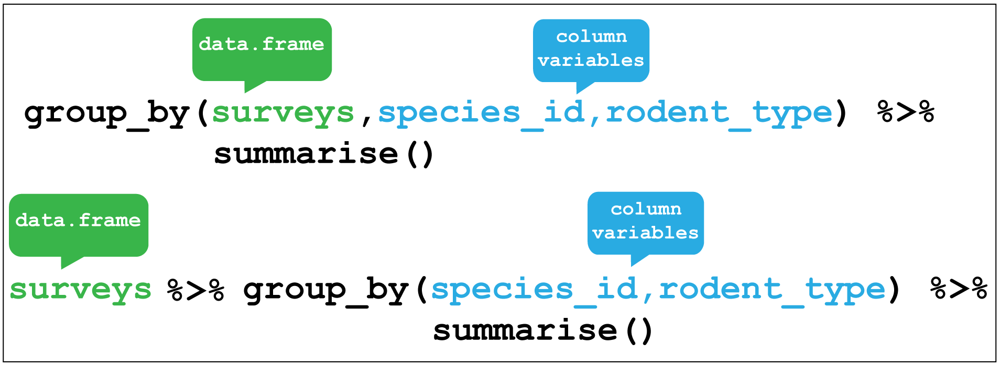

# `dplyr` verbs and piping {#dplyr}

A core package in the tidyverse is `dplyr` for transforming data, which is often
used in conjunction with the `magrittr` package that allows us to pipe multiple
operations together.

The R4DS dplyr chapter is [here](http://r4ds.had.co.nz/transform.html) and for
magrittr [here](http://r4ds.had.co.nz/pipes.html).

The figures in this chapter we made for use with an ecological dataset on rodent
surveys, but the principles they illustrate are generic and show the use of 
each function with or without the use of a pipe.

From R4DS:

"*All `dplyr` verbs work similarly:*

*1. The first argument is a data frame.*

*2. The subsequent arguments describe what to do with the data frame, using the variable names (without quotes).*

*3. The result is a new data frame.*

*Together these properties make it easy to chain together multiple simple steps to achieve a complex result.*"

## Pipes {#pipes}

A pipe in R looks like this `%>%` and allows us to send the output of one 
operation into another. This saves time and space, and can make our code easier
to read.

For example we can pipe the output of calling the `dat` object into the `glimpse`
function like so: 

```{r pipe-glimpes, eval=T}
dat %>% glimpse()
```

This becomes even more useful when we combine pipes with `dplyr` functions.

## Filter rows {#filter}

The `filter` function enables us to filter the rows of a data frame according to
a logical test (one that is `TRUE` or `FALSE`). Here it filters rows in
the surveys data where the year variable is greater or equal to 1985. 

```{r filter,fig.asp=1, out.width= '80%', fig.align='center', echo=FALSE}

```

Let's try this with `dat` to filter the rows for proteins in `control_1` and 
`control_2` experiments where the observations are greater than 20:

```{r filter-dat}
dat %>% filter(control_1 > 20, control_2 > 20)
```

Filtering is done with the following operators `>`,`<`,`>=`,`<=`,`!=` (not equal)
and `==` for equal. Not the double equal sign.

## Arrange rows

Arranging is similar to filter except that it changes the row order according
to the columns in ascending order. If you provide more than one column name, 
each additional column will be used to break ties in the values of preceding 
columns.

Here we arrange the surveys data according to the record identification number.

```{r arrange,fig.asp=1, out.width= '80%', fig.align='center', echo=FALSE}

```

To try that with `dat` let's arrange the data according to `control_1`:

```{r dat-arrange}
dat %>% arrange(control_1)
```

## Select columns

Selecting is the verb we use to select columns of interest in the data. Here
we select only the `year` and `plot_type` columns and discard the rest.

```{r select,fig.asp=1, out.width= '80%', fig.align='center', echo=FALSE}
knitr::include_graphics("img/dplyr_select.png")
```

Let's use select with `dat` to drop the protein description and control 
experiments using negative indexing and keep everything else:

```{r dat-select}
dat %>% select(-protein_description,-(control_1:control_3))
```

## Create new variables {#mutate}

Creating new variables uses the `mutate` verb. Here I am creating a new 
variable called `rodent_type` that will create a new column containing the type
of rodent observed in each row.

```{r mutate,fig.asp=1, out.width= '80%', fig.align='center', echo=FALSE}

```

Let's create a new variable for `dat` called `prot_id` that use the `str_extract`
function from the `stringr` package to take the last 6 characters of
the `protein_accession` variable, the `".{6}$"` part is called a regular 
expression, to keep just the UNIPROT id part of the string.

We'll use select to drop the other variables except the 
protein accession afterwards via another pipe.

```{r dat-mutate}
dat %>% 
  mutate(prot_id = str_extract(protein_accession,".{6}$")) %>% 
  select(protein_accession, prot_id)
```

## Create grouped summaries

The last key verb is `summarise` which collapses a data frame
into a single row. 

For example, we could use it to find the average weight
of all the animals surveyed in the surveys data using `mean()`. 
(Here the `na.rm = TRUE` argument is given to remove missing values from the 
data, otherwise R would return `NA` when trying to average.)

```{r summarise,fig.asp=1, out.width= '80%', fig.align='center', echo=FALSE}
knitr::include_graphics("img/dplyr_summarise.png")
```

`summarise` is most useful when paired with `group_by`
which defines the variables upon which we operate upon. 

Here if we group by `species_id` and `rodent_type` together and then used 
`summarise` without any arguments we return these two variables only.

```{r group-by,fig.asp=1, out.width= '80%', fig.align='center', echo=FALSE}

```

We'll use the `mtcars` dataset again to illustrate a grouped summary. Here
I'll group according gearbox type `am` where 0 is automatic and 1 is manual.
Then using summarise to calculate the mean miles per gallon, the tables is
collapsed to two rows, one for each gearbox type.

```{r dat-group_mean}
# mtcars, am is gearbox, 0 = automatic, 1 = manual 
mtcars %>% 
  group_by(am) %>% 
  summarise(mean_mpg = mean(mpg, na.rm = T))
```

We'll use `dplyr` and pipes in Chapter \@ref(transform).