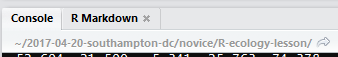
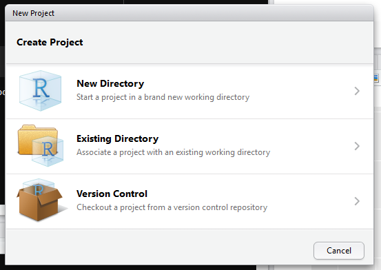

--- 
title: "Data Science Workshop"
subtitle: "British Society for Proteomic Research Meeting 2018"
author: "Alistair Bailey"
date: "`r format(Sys.Date(),format='%B %d %Y')`"
output: 
  bookdown::gitbook: default
  bookdown::epub_book: default
  bookdown::pdf_book:
    includes:
      in_header: preamble.tex
    keep_tex: yes
    citation_package: natbib
    latex_engine: xelatex
documentclass: book
fontsize: 12pt
linestretch: 1.5
toc-depth: 1
secnumdepth: 1
lof: FALSE
lot: FALSE
site: bookdown::bookdown_site
bibliography: [packages.bib, book.bib]
biblio-style: apalike
link-citations: yes
#geometry: "left=4cm, right=3cm, top=2.5cm, bottom=2.5cm"
description: "Lessons for the BSPR 2018 Data Science Workshop"
---

```{r include=FALSE}
library(tidyverse)
library(janitor)
library(cowplot)
#library(VennDiagram)
#library(gridExtra)
#library(cowplot)
# automatically create a bib database for R packages
knitr::write_bib(c(.packages(), 'bookdown', 'knitr', 'rmarkdown'), 'packages.bib')

options(knitr.graphics.auto_pdf = TRUE)
```

# Overview {-}

These lessons cover:

1. An introduction to R and RStudio
2. An introduction to the tidyverse
3. Importing and transforming proteomics data
4. Visualisation of proteomics analysis

The analysis is of an example data set of observations for 7702 proteins
from cells in three control experiments and three treatment experiments.
The observations are signal intensity measurements from the mass spectrometer.
These intensities relate to the amount of protein in each experiment and under 
each condition. The analysis transforms the data to examine the effect of
treatment on the cellular proteome and visualise the output using a volcano
plot and a heatmap. 
<a href="https://raw.githubusercontent.com/ab604/ab604.github.io/master/docs/070718-proteomics-example-data.csv" download>Click here to download the csv file.</a>

## Requirements {-}

Up to date version of R [@R-base] and Rstudio [@rstudioteam2018]

The following R packages:

```{r packages, eval=FALSE}
install.packages(c("tidyverse","gplots","pheatmap"))
```


<!--chapter:end:index.Rmd-->

# Introduction {#intro}

There are many resources for learning R on the web, but much of this material 
derives from a [Data Carpentry lesson](http://www.datacarpentry.org/lessons/) 
using ecological data that I have previously 
[reworked](https://southampton-rsg.github.io/2017-08-01-southampton-dc/novice/R-ecology-lesson/index.html), 
which in turn takes a lot from [Hadley Wickham's R for Data Science](http://r4ds.had.co.nz/). 
Follow the links to access those materials.

In terms of philosophy:

1. The primary motivation for using tools such as R is to get more done, in
less time and with less pain.

2. And the overall aim is to *understand and communicate* findings from our
data.

(ref:pipeline) Data project workflow.

```{r pipeline, fig.cap='(ref:pipeline)',fig.asp=1, out.width= '80%', fig.align='center', echo=FALSE}
knitr::include_graphics("img/data_project_pipeline.png")
```

As shown in Figure \@ref(fig:pipeline) of typical data analysis workflow,
to acheive this aim we need to learn tools that enable us to perform the 
fundamental tasks of tasks of importing, tidying and 
often transforming the data. Transformation means for example, selecting a 
subset of the data to work with, or calculating the mean of a set of observations.
We'll cover that in Chapter \@ref(transform).

But first...

## What are R and RStudio?

***"There are only two kinds of languages: the ones people complain about and the ones nobody uses"***

*Bjarne Stroustrup*

**R** is a programming language that follows the philosophy laid down by it's
predecessor S. The philosophy being that users begin in an interactive
environment where they don't consciously think of themselves as programming. 
It was created in 1993, and documented in [@ihaka1996].

Reasons R has become popular include that it is both open source and cross platform,
and that it has broad functionality, from the analysis of data and creating 
powerful graphical visualisations and web apps.

Like all languages though it has limitations, for example the syntax is initially
confusing. 

Take for example the word `environment`...

### Environments

An environment is where we bring our data to work with it. Here we work in a R 
envrionment, using the R language as a set of tools.
**RStudio** is an integrated development environment, or IDE for R programming. 
It is regularly updated, and upgrading enables access to the latest features. 

The latest version can be downloaded here: http://www.rstudio.com/download

## Why learn R, or any language ?

We can write R code without saving it, but it's generally more useful to write 
and save our code as a script. Working with scripts makes the steps you used in 
your analysis clear, and the code you write can be inspected by someone else who 
can give  you feedback and spot mistakes.

Learning R (or any programming language) and working with scripts forces you to 
have deeper understanding of what you are doing, facilitates your learning 
and comprehension of the methods you use:

+ Writing and publishing code is important for reproducible resarch
+ R has many thousands of packages covering many disciplines.
+ R can work with many types of data.
+ They is a large R community for development and support.
+ Using R gives you control over your figures and reports.

## Finding your way around RStudio

Let's begin by learning about [RStudio](https://www.rstudio.com/), the
Integrated Development Environment (IDE).

We will use R Studio IDE to write code, navigate the files found on our computer,
inspect the variables we are going to create, and visualize the plots we will
generate. R Studio can also be used for other things (e.g., version control,
developing packages, writing Shiny apps) that we don't have time to cover during
this workshop.

R Studio is divided into "Panes", see Figure \@ref(fig:rstudio). 

When you first open it, there are three panes,the console where you type 
commands, your environment/history (top-right), and your
files/plots/packages/help/viewer (bottom-right).

The enivronment shows all the R objects you have created or are using, such
as data you have imported.

The output pane can be used to view any plots you have created.

Not opened at first start up is the fourth default pane: the script editor pane, 
but this will open as soon as we create/edit a R script (or many other document types). 
*The script editor is where will be typing much of the time.*


(ref:rstudio) The Rstudio Integrated Development Environment (IDE).

```{r rstudio,fig.cap='(ref:rstudio)',fig.asp=1, out.width= '80%', fig.align='center', echo=FALSE}
knitr::include_graphics("img/rstudio_ide_image.png")
```

The placement of these panes and their content can be customized (see menu, 
R Studio -> Tools -> Global Options -> Pane Layout). One of the advantages of 
using R Studio is that all the information you need to write code is available 
ina single window. Additionally, with many shortcuts, auto-completion, and 
highlighting for the major file types you use while developing in R, R Studio 
will make typing easier and less error-prone.

Time for a philosphical diversion...

### What is real?

At the start, we might consider our environment "real" - that is to say the objects
we've created/loaded and are using are "real". But it's much better in the long run
to consider our scripts as "real" - our scripts are where we write down the code
that creates our objects that we'll be using in our environment.

**As a script is a document, it is reproducible**

Or to put it another way: we can easily recreate an environment from our scripts, 
but not so easily create a script from an enivronment.

To support this notion of thinking in terms of our scripts as real, we recommend
turning off the preservation of workspaces between sessions by setting the 
Tools > Global Options menu in R studio as shown in Figure @\ref(fig:turn-off):

(ref:turn-off) Don't save your workspace!


```{r workspace,fig.cap='(ref:turn-off)',fig.asp=1, out.width= '80%', fig.align='center', echo=FALSE}
knitr::include_graphics("img/rdata_turn_off.png")
```

## Where am I?

R studio tells you where you are in terms of directory address like so:

(ref:working-dir)

```{r working-directory,fig.cap='(ref:working-dir)',fig.asp=1, out.width= '80%', fig.align='center', echo=FALSE}

```

If you are unfamiliar with how computers structure folders and files, then 
consider a tree with a root from which the trunk extends and branches divide.
In the image above, the ~ symbol represents a contraction of the path from the
root to the 'home' directory (in Windows this is 'Documents') and then the 
forward slashes are the branches. (Note: Windows uses backslashes, Unix type 
systems and R use forwardslashes).

It is good practice to keep a set of related data, analyses, and text
self-contained in a single folder, called the **working directory**. All of the
scripts within this folder can then use *relative paths* to files that indicate
where inside the project a file is located (as opposed to absolute paths, which
point to where a file is on a specific computer). Working this way makes it
a lot easier to move your project around on your computer and share it with
others without worrying about whether or not the underlying scripts will still
work.

(ref:dir-structure) A typical directory structure

```{r dir-structure,fig.cap='(ref:dir-structure)',fig.asp=1, out.width= '80%', fig.align='center', echo=FALSE}
knitr::include_graphics("img/R-ecology-work_dir_structure.png")
```

## R projects

RStudio also has a facility to keep all files associated with a particular 
analysis together called a project.

Creating a project creates a working directory for you and also remembers
its location (allowing you to quickly navigate to it) and optionally preserves
custom settings and open files to make it easier to resume work after a
break. 

(ref:r-projects)

```{r r-projects,fig.cap='(ref:r-projects)',fig.asp=1, out.width= '80%', fig.align='center', echo=FALSE}

```

Below, we will go through the steps for creating an "R Project":

* Start R Studio (presentation of R Studio -below- should happen here)
* Under the `File` menu, click on `New project`, choose `New directory`, then
  `Empty project`
* Enter a name for this new folder (or "directory", in computer science), and
  choose a convenient location for it. This will be your **working directory**
  for the rest of the day (e.g., `~/bspr-workshop`)
* Click on "Create project"
* Under the `Files` tab on the right of the screen, click on `New Folder` and
  create a folder named `data` within your newly created working directory. (e.g., `~/bspr-workshopdata`)
* Create a new R script (File > New File > R script) and save it in your working
  directory (e.g. `bspr-workshop-script.R`)
  
## Naming things {#names}
  
[Jenny Bryan](https://ropensci.org/blog/2017/12/08/rprofile-jenny-bryan/)
has three principles for [naming things](http://www2.stat.duke.edu/~rcs46/lectures_2015/01-markdown-git/slides/naming-slides/naming-slides.pdf) that are well worth remembering.

When you names something, a file or an object, ideally it should be:
  
1. Machine readable (no whitespace, punctuation, upper AND lowercase...)
2. Human readable  (makes sense in 6 months or 2 years time)
3. Plays well with default ordering (numerical or date order)

## Seeking help

If you need help with a specific R function, let's say `barplot()`, you can type:

```{r barplot, eval=FALSE}
?barplot
```


If you can't find what you are looking for, you can use the
[rdocumention.org](http://www.rdocumentation.org) website that searches through
the help files across all packages available.

A Google or internet search "R \<task\>" will often either send you to the appropriate package documentation or a helpful forum question that someone else already asked,
such as [Stack Overflow](http://stackoverflow.com/questions/tagged/r).

### Asking for help

As well as knowing [where to ask](https://www.tidyverse.org/help/#where-to-ask), the key to get help 
from someone is for them to grasp your problem rapidly. You
should make it as easy as possible to pinpoint where the issue might be.

Try to use the correct words to describe your problem. For instance, a 
package is not the same thing as a library. Most people will understand 
what you meant, but others have really strong feelings about the difference
in meaning. The key point is that it can make things confusing for people 
trying to help you. Be as precise as possible when describing your problem.

If possible, try to reduce what doesn't work to a simple *reproducible
example* otherwise known as a *reprex*. 

For more information on how to write a reproducible example see 
[this article](https://www.tidyverse.org/help/#reprex).

<!--chapter:end:01-intro.Rmd-->

# Getting started in R and the tidyverse {#tidyverse}

## Tidy data and the tidyverse

R is a programming language, and written in R is *"an opinionated collection 
of R packages designed for data science"* called [tidyverse](https://www.tidyverse.org/). 

Tidyverse packages *"share an underlying design philosophy, grammar, and data structures."* It's this philiosophy that makes them relatively easy to learn
and use.

The principals of tidy data for tabular data as proposed in the Tidy Data 
paper http://www.jstatsoft.org/v59/i10/paper are:

1. Every variable has its own column.
2. Every observation has its own row.
3. Each value has its own cell.

If our table was proteomics data then, we might have a set of variables such 
as the peptide sequence, mass or length observed for a number of peptides.
Therefore each peptide would have a row with columns for peptide sequence, mass and length with the value for each variable in separate cells, as
seen in Figure \@ref(fig:tidy-prot).

(ref:tidy-prot) An example of tidy proteomics data

```{r tidy-prot, fig.cap='(ref:tidy-prot)',fig.asp=1, out.width= '80%', fig.align='center', echo=FALSE}
knitr::include_graphics("img/tidy_prot_data.PNG")
```

We can't do everything in the tidyverse, and everything we can do in the 
tidyverse can be done in what is called base R or other packages, but the 
motivation behind the tidyverse is to ease the pain of data manipulation.

With this in mind, the two tasks we are most likely to want to do 
in data science are:

1. Visualise our data
2. Automate our processes.

Taking our cue from [R4DS](http://r4ds.had.co.nz/) let's try an example.

## Data visualisation

Let's begin with visualisation of some data using the `ggplot2` package,
which implements the *grammer of graphics*, for describing
and building graphs.

The motivation here is twofold: to begin to grasp the grammar of graphics
approach to creating plots, and most importantly to demonstrate how 
plotting is often the most useful thing we can do when trying to understand
what is going on.

We'll use the `mpg` dataset that comes with the tidyverse to examine
the question *do cars with big engines use more fuel than cars with small engines?*

Try `?mpg` to learn more about the data.

1. Engine size in litres is in the `displ` column.
2. Fuel efficiency on the highway in miles per gallon is given in the `hwy` column.

To create a plot of engine size `displ` (x-axis) against fuel efficiency `hwy` (y-axis)  we do the following:

1. Use the `ggplot()` function to create an empty graph.
2. We give ggplot a first argument of the data (here `mpg`). 
3. Then we follow the ggplot function with a `+` sign to indicate
we are going to add more coed, followed by a `geom_point()` function to add a layer of points mapping some aesthetics for the x and y axes.
4. Mapping is always paired to aesthetics `aes()`. An aesthetic is a visual property of the objects in your plot, such a point size, shape or point colour.

Therefore to plot engine size (x-axis) against fuel efficiency (y-axis) we 
use the following code:

```{r mpg-plot-1,mpg_point_plot}
ggplot(data = mpg) + 
  geom_point(mapping = aes(x = displ, y = hwy))
```

This plot shows a negative relationship between engine size and fuel 
efficiency.

Now try extending this code to include to add a `colour` aesthetic to the
the `aes()` function, let `colour = class`, `class` being the veichle type.
This should create a plot with as before but with the points coloured
according to the viechle type to expand our understanding.

```{r, mpg-plot-2}
ggplot(data = mpg) + 
  geom_point(mapping = aes(x = displ, y = hwy, colour = class))
```

Now we can see that as we might expect, bigger cars such as SUVs tend to have 
bigger engines and are also less fuel efficient, but some smaller cars such as 
2-seaters also have big engines and greater fuel efficiency. Hence we have a 
more nuanced view with this additional aesthetic.

Check out the ggplot2 documentation for all the aesthetic possibilities (and 
Google for examples): http://ggplot2.tidyverse.org/reference/

So now we have re-usable code snippet for generating plots in R:

```{r, purl=FALSE,eval=FALSE}
ggplot(data = <DATA>) + 
  <GEOM_FUNCTION>(mapping = aes(<MAPPINGS>))
```

Concretely, in our first example `<DATA>` was `mpg`, the `<GEOM_FUNCTION>` 
was `geom_point()` and the arguments we supplies to map our aesthetics 
`<MAPPINGS>` were `x = displ, y = hwy`.

Hopefully you are beginning to see how a single line of code can do a lot with
tidy data.

## Workflow basics

Let's run through the basics of working in R to conclude this chapter.

### Assigning objects

Objects are just a way to store data inside the R environment. We create objects using the assignment operator `<-`:

```{r mass-kg}
mass_kg <- 55
```

Read this as *"mass_kg gets value 55"* in your head.

Using `<-` can be annoying to type, so use RStudio’s keyboard short cut: 
Alt + - (the minus sign) to make life easier. 

Object name style is a matter of choice, but must start with a letter and can 
only contain letters, numbers, `_` and `.`. We recommend using descriptive names
and using `_` between words. Some special symbols cannot be used in variable 
names, so watch out for those.

So here we've used the name to indicate its value represents a mass in kilograms. Look in your environment pane and you'll see the `mass_kg` object containing the (data) value 55.

We can inspect an object by typing it's name:

```{r mass-inspect}
mass_kg
```

What's wrong here?

```{r mass-wrong-name, eval=FALSE}
mass_KG
```
`Error: object 'mass_KG' not found`

This error illustrates that typos matter, everything must be precise and `mass_KG`
is not the same as `mass_kg`. `mass_KG` doesn't exist, hence the error.

### Calling functions

Functions in R are objects followed by parentheses, such as `library()`. 
Functions have the form:

`function_name(arg1 = val, arg2 = val2, ...)`

Let's use `seq()` to create a **seq**uence of numbers, and at the same time practice tab completion.

Start typing `se` in the console and you should see a list of functions appear,
add `q` to shorten the list, then use the up and down arrow to highlight the function
of interest `seq()` and hit Tab to select.

RStudio puts the cursor between the parentheses to prompt us to enter some 
arguments. Here we'll use 1 as the start and 10 as the end:

```{r sequence-function}
seq(1,10)
```

If we left off a parentheses to close the function, then when we hit enter 
we'll see a `+` indicating RStudio is expecting further code. We either add the 
missing part or press Escape to cancel the code.

Let's call a function and make an assignment at the same time. Here we'll use
the base R function `seq()` which takes three arguments: `from`, `to` and `by`.

Read the following code as *"make an object called my_sequence that stores a sequence of numbers from 2 to 20 by intervals of 2*.

```{r sequence-object}
my_sequence <- seq(2,20,2)
```

This time nothing was returned to the console, but we now have an object called
`my_sequence` in our environment.

Can you remember how to inspect it?

If we want to subset elements of `my_sequence` we use 
square brackets `[]`.

For example element five would be subset by:

```{r sequence-element}
my_sequence[5]
```

Here the number five is the index of the vector, not the value of the fifth element. The value of the fifth element is 10. 

And returning multiple elements uses a colon `:`, like so

```{r sequence-range}
my_sequence[5:8]
```

### Atomic vectors

We actually made an atomic vector already when we made `my_sequence`. We made a
a one dimensional group of numbers, in a sequence from two to twenty.

We're not going to be working much with atomic vectors in this workshop, 
but to make you aware of how R stores data, atomic vector types 
are: 

+ Doubles: regular numbers, +ve or -ve and with or without decimal places. AKA numerics.
+ Integers: whole numbers, specified with an upper-case L, e.g. `int <- 2L`
+ Characters: Strings of text
+ Logicals: these store `TRUE`s and `FALSE`s which are useful for comparisons.
+ Complex: this would be a vector of numbers with imaginary terms. 
+ Raw: these vectors store raw bytes of data.

Let's make a character vector and check the type:

```{r cards-characters}
cards <- c("ace", "king", "queen", "jack", "ten")

cards

typeof(cards)
```

### Attributes 

An attribute is a piece of information you can attach to an object, such as
names or dimensions. Attributes such as dimensions are added when 
we create an object, but others such as names can be added.

Let's look at the `mpg` data frame dimensions:

```{r attributes}
# mpg has 234 rows (observations) and 11 columns (variables)
dim(mpg)
```

### Factors

Factors are Rs way of storing categorical information such as eye colour or
car type. A factor is something that can only have certain values, and can be
ordered (such as `low`,`medium`,`high`) or unordered such as types of fruit.

Factors are useful as they code string variables such as "red" or "blue" to integer values e.g. 1 and 2, which can be used in statistical models and when plotting, but they are confusing as they look like strings. 

**Factors look like strings, but behave like integers.**

Historically R converts strings to factors when we load and create data, but 
it's often not what we want as a default. Fortunately, in the tidyverse strings
are not treated as factors by default.

### Lists

Lists also group data into one dimensional sets of data. The difference being 
that list group objects instead of individual values, such as several atomic 
vectors.

For example, let's make a list containing a vector of numbers and a character
vector

```{r list-example}
list_1 <- list(1:110,"R")

list_1
```

Note the double brackets to indicate the list elements, i.e. element one is the
vector of numbers and element two is a vector of a single character.

We won't be working with lists in this workshop, but they are a flexible way to 
store data of different types in R. 

Accessing list elements uses double square brackets syntax, for example
`list_1[[1]]` would return the first vector in our list. 

And to access the first element in the first vector would combine double and
single square brackets like so: `list_1[[1]][1]`.

Don't worry if you find this confusing, everyone does when they first start with
R.

### Matrices and arrays

Matrices store values in a two dimensional array, whilst arrays can have n 
dimensions. We won't be using these either, but they are also valid R objects.

### Data frames

Data frames are two dimensional versions of lists, and this is form of storing
data we are going to be using. In a data frame each atomic vector type becomes
a column, and a data frame is formed by columns of vectors of the same length.
Each column element must be of the same type, but the column types can vary.

Figure \@ref(fig:df) shows an example data frame we'll refer to as
saved as the object `df` consisting of three rows and three columns. Each 
column is a different atomic data type of the same length.

(ref:df) An example data frame `df`.


```{r df,fig.cap='(ref:df)', fig.asp=1, out.width= '80%', fig.align='center', echo=FALSE}
knitr::include_graphics("img/data_frame.png")
```

Packages in the  tidyverse create a modified form of data frame called a tibble.
You can read about tibbles [here](http://r4ds.had.co.nz/tibbles.html). One 
advantage of tibbles is that they don't default to treating strings as factors. 
We deal with modifying data frames when we work with our example data set.

Sub-setting data frames can also be done with square bracket syntax, but as we
have both rows and columns, we need to provide index values for both row and 
column.

For example `df[1,2]` means **return the value of `df` row 1, column 2**. This corresponds with the value `A`. 

We can also use the colon operator to choose
several rows or columns, and by leaving the row or column blank we return all 
rows or all columns.

```{r subset-df, eval=FALSE}
# Subset rows 1 and 2 of column 1
df[1:2,1]

# Subset all rows of column 3
df[,3]
```

Again don't worry too much about this for now, we won't be doing to much of this
in this lesson, but it's important to be aware of the basic syntax.

## Learning more R

There are many places to start, but swirl can teach you interactively, and at your own pace in RStudio.

Just follow the instructions via this link: http://swirlstats.com/students.html

*Hands-On Programming with R* by Garrett Grolemund is another great resource 
for learning R.

Plus all the [tidyverse links](https://www.tidyverse.org/learn/).

<!--chapter:end:02-tidyverse.Rmd-->

# Creating scripts and importing data {#import}

Our analysis is of an example data set of observations for 7702 proteins
from cells in three control experiments and three treatment experiments.
The observations are signal intensity measurements from the mass spectrometer.
These intensities relate to the amount of protein in each experiment and under 
each condition.

We consider raw data as the data as we receive it. This doesn't mean it hasn't be
processed in some way, it just means it hasn't been processed by us.
Generally speaking we don't change the raw data file, what we do is import it and
create an object in R which we then transform.

So let's understand how to import some data.

## Some definitions

 + Importing means getting data into our R environment by turning into into a
 R object that we can then manipulate. The raw data file remains unchanged.
 + Inspecting means looking at the dataset to understand what it contains.
 + Tidying refers to getting data into a consistent format that makes it easy to
 use in later steps.
 
 A note here is that we are focusing on rectangular data, the sort that comes
 in rows and columns such as in a spreadsheet. Lots of our data types exist,
 such as images, which are beyond the scope of this lesson, but can also be
 handled by R.
 
## Using scripts

Using the console is useful, but as we build up a workflow, that is to say,
wring code to:

+ load packages 
+ load data
+ explore the data 
+ and output some results

Then it's much more useful to contain this in a script: a document of our code.

Why? When we write and save our code in scripts, we can re-use it, share it or 
edit it. But **most importantly a script is a record**.

Cmd/Ctrl + Shift + N will open a new script file up and you should see something
like Figure \@ref(fig:script-pane) with the script editor pane open:

(ref:script-pane) Rstudio with the script editor pane open.

```{r script-pane, fig.cap = '(ref:script-pane)', fig.asp=1, out.width= '80%', fig.align='center', echo=FALSE}
knitr::include_graphics("img/rstudio_screenshot_four_panes.PNG")
```

## Running code

We can run a highlighted portion of code in your script if you click the Run
button at the top of the scripts pane as shown in Figure \@ref(fig:run-script). 

(ref:run-script)

```{r run-script, fig.cap= '(ref:run-script)',fig.asp=1, out.width= '80%', fig.align='center', echo=FALSE}
knitr::include_graphics("img/run_script.PNG")
```

You can run the entire script by clicking the Source button.

Or we can run chunks of code if we split our script into sections, see below.

## Creating a R script

We first need to create a script that will form the basis of our analysis.

Go to the file menu and select New Files > R script. This should open the script
editor pane.

Now let's save the script, by going to File > Save and we should find ourselves
prompted to save the script in our Project Directory.

Following the advice about [naming things](#names) we can create a new R script
called `01-bspr-workshop-july-2018`.

This name is machine readable (no spaces or special characters), human readable,
and works well with default ordering by beginning with `01`.

## Setting up our environment

At the head of our script it's common to put a title, the name of the author
and the date, and any other useful information. This is created as comments 
using the `#` at the start of each line.

It's then usual to follow this by code to load the packages we need into our
our R environment using the `library()` function and providing the name of the
package we wish to load. Packages are collections of R functions.

Often we break the code up into regions by adding dashes (or equals symbols) 
to the comment line. This enables us to run chunks of the script separately from
running the whole script when using our code.

Here is a typical head for a script:

```{r set-up, eval=FALSE}
# My workshop script
# 7th July 2018
# Alistair Bailey

# Load packages ----------------------------------------------------------------
library(tidyverse)
library(gplots)
library(pheatmap)
```

### Bioconductor

As an aside there are many proteomics specific R packages, these are generally
found through [Bioconductor](https://www.bioconductor.org/) which is a project
that was initiated in 2001 to create tools for the analysis of high-throughput 
genomic data, but also includes other 'omics data tools [@gentleman2004,@huber2015].

Exploring Bioconductor is beyond our scope here, but well worth exploring for
manipulation and analysis of raw data formats such as mzxml files.

## Importing data

Assuming our data is in a flat format, we can import it into our environment
using the tidyverse `readr` package. A flat format is a file that contains only
text  such as `csv` or tab separated data without meta-data (extra information), 
such as the colour of cells in an excel file. 

If we our data was an excel file, we can use the tidyverse `readxl` package to 
import the data.

For the purposes of this workshop we have a `csv` (comma separated variable) file.

If you haven't done so already
<a href="https://raw.githubusercontent.com/ab604/ab604.github.io/master/docs/070718-proteomics-example-data.csv" download>Click here to download</a> the example data and save it to our project 
directory. Check the `Files` pane to see it's there.

We then import data and assign it to an object we'll call `data` like so:

```{r example-data, echo=FALSE, eval=F,cache=T}
# Charlotte's data
dat <- read_csv("data/MergedFinalProt_2colPerFile_12files_filtered_ch.csv",
                   na = "NaN", col_types = cols()) %>% clean_names()

# Clean it up for workshop, keep missing values
dat_select <- dat %>%
#   # Select and rename columns
  select(protein_accession = protein_entry_protein_accession,
         protein_description,
         control_1 = c1,
         control_2 = c2,
         control_3 = c3,
         treatment_1 = t1,
         treatment_2 = t2,
         treatment_3 = t3)

# Write out the example data
write_csv(dat_select,"data/070718-proteomics-example-data.csv")
```

```{r import-data, eval=TRUE, cache=TRUE}
# Import example data ----------------------------------------------------------
# Import the example data with read_csv from the readr package
dat <- readr::read_csv("data/070718-proteomics-example-data.csv")
```

## Exploring the data

The first thing to do with any data set is to actually look at it. Here are
three ways to have look in the `Console`: 

```{r examine-data}
# call object
dat

# tidyverse glimpse function
glimpse(dat)

# head function
head(dat)

# str function
str(dat)
```

To see the data in a *spreadsheet* fashion use `View(dat)`, note the capital V
and a new tab will open. This can also be launched from the `Environment` tab by
clicking on `dat`.

Although this provides us with some useful information, such as the number of
observations and variables, to understand more plotting the data will be
helpful as we'll see in Section [#normalisation].

<!--chapter:end:03-importing.Rmd-->

# Transformation and visualisation {#transform}

Having imported our data set of observations for 7702 proteins
from cells in three control experiments and three treatment experiments.
Remember, the observations are signal intensity measurements from the mass spectrometer,
and these intensities relate to the amount of protein in each experiment and under 
each condition.

Next we will transform the data to examine the effect of
the treatment on the cellular proteome and visualise the output using a volcano
plot and a heatmap.

## Fold change and log-fold change

Fold changes are ratios, the ratio of say protein expression before and
after treatment, where a value larger than 1 for a protein implies that 
protein expression was greater after the treatment.

In life sciences, fold change is often reported as log-fold change. Why is that?
There are at least two reasons which can be shown by plotting.

One is that ratios are not symmetrical around 1, so it's difficult to observe
both changes in the forwards and backwards direcion i.e. proteins where expression
went up and proteins where expression went down due to treatment. When we 
transform ratios on a log scale, the scale becomes symmetric around 0 and thus
we can now observe the distribution of ratios in terms of positive, negative or
no change.

(ref:logratios) Ratios are not symmetric around one, logratios are symmetric around zero.

```{r fold-change-1,fig.cap='(ref:logratios)', echo=FALSE, cache=TRUE}
set.seed(10)
x <- 2^(rnorm(100))
y <- 2^(rnorm(100))
ratios <- tibble(value = x/y, label = "ratios")
logratios <- tibble(value = log2(ratios$value), label = "logratios")


bind_rows(ratios,logratios) %>% 
  mutate(label = factor(label, levels = c("ratios","logratios"))) %>% 
  ggplot(aes(value)) +
  geom_histogram(binwidth = 2, colour = "grey50", fill = "white") +
  ggplot2::facet_wrap(~ label) +
  xlab("") +
  ylab("") +
  theme_minimal()
```

A second reason is that transforming values onto a log scale changes where
the numbers actually occur when plotted on that scale. If we consider the log
scale to represent magnitudes, then we can more easily see changes of small and
large magnitudes when we plot the data.

For example, a fold change of 32 times can be either a ratio 1/32 or 32/1. 

As shown in Figure \@ref(fig:fold-change-2), 1/32 is much closer to 1 than 32/1, but 
transformed to a log scale we see that in terms of magnitude of difference it is the same as 32/1.

(ref:logratio-2) Transformation of scales using log transformation.

```{r fold-change-2, fig.cap='(ref:logratio-2)', echo=FALSE, cache=TRUE}
x2 <- 2^seq(1,5)
y_vals <- c(rev(1/x2),1,x2)
names <- c(paste0("1/",rev(x2)),1,x2)
x_vals <- seq(along=y_vals)

dat <- tibble(x_vals,y_vals,names)

p1 <- ggplot(dat,aes(x_vals,y_vals, label = names)) +
  geom_text() +
  geom_hline(yintercept = 1) +
  theme_minimal() +
  labs(x = NULL, y = NULL) +
  scale_x_continuous(breaks = NULL)


p2 <- ggplot(dat,aes(x_vals,y_vals, label = names)) +
  geom_text() +
  geom_hline(yintercept = 1) +
  scale_y_continuous(trans = "log2") +
  theme_minimal() +
  labs(x = NULL, y = NULL) +
  scale_x_continuous(breaks = NULL)

plot_grid(p1,p2)
```

## Dealing with missing values and normalisation {#normalisation}

1. Load the data, we need multiple replicates for each condition. To be tidy
each protein is a set of observations (rows) of the variables, which are the
values recorded for each replicate (columns).

2. Tidy up and deal with missing values, either impute or exclude missing values
and normalise.

Let's consider our proteomics data as a distribution of values, one value for 
each protein in our experiment that together form a distribution. 
If we have replicate experiments we'll therefore have multiple distributions.

A quantile represents a region of distribution, for example the 0.95 quantile
is the value such that 95% of the data lies below it. To normalise two or more
distributions with each other without recourse to a reference distribution we:

(i) Rank the value in each experiment (represented in the columns) from 
lowest to highest. In other words identify the quantiles.
(ii) Sort each experiment (the columns) from lowest to highest value.
(iii) Calculate the mean across the rows for the sorted values.
(iv) Then substitute these mean values back according to rank for each experiment to restore the original order.

This results in the highest ranking observation in each experiment
becoming the mean of the highest observations across all experiments, the
second ranking observation in each experiment becoming the mean of the 
second highest observations across all experiments.

[Dave Tang's Blog:Quantile Normalisation in R](https://davetang.org/muse/2014/07/07/quantile-normalisation-in-r/) has more
details on this approach.


(ref:quant-norm) Quantile Normalisation from [Rafael Irizarry's tweet](https://twitter.com/rafalab/status/545586012219772928?ref_src=twsrc%5Etfw).

```{r quant-norm, fig.cap='(ref:quant-norm)',fig.asp=1, out.width= '80%', fig.align='center', echo=FALSE}
knitr::include_graphics("img/quant_norm.png")
```

```{r missing values}
# Tidy data up
#dat_tidy <- dat_select %>% drop_na()
dat_tidy <- dat %>% drop_na()
```

```{r unnorm-data, echo= FALSE}
# Plot data
d1 <- dat_tidy %>%
  gather(experiment,value,-c(1:2)) %>%
  ggplot(aes(log2(value),colour = experiment)) +
   geom_density()

d1
```

```{r max-norm}
# Normalise to maximum column value
dat_norm_max <- dat_tidy %>%
  mutate(control_1 = control_1/max(control_1),
         control_2 = control_2/max(control_2),
         control_3 = control_3/max(control_3),
         treatment_1 = treatment_1 / max(treatment_1),
         treatment_2 = treatment_2 / max(treatment_2),
         treatment_3 = treatment_3 / max(treatment_3)
         )
```


```{r quant-norm-function}
# Quantile normalisation : the aim is to give different distributions the
# same statistical properties
quantile_normalisation <- function(df){
  df_rank <- apply(df,2,rank,ties.method="average")
  df_sorted <- data.frame(apply(df, 2, sort))
  df_mean <- apply(df_sorted, 1, mean)
   
  index_to_mean <- function(my_index, my_mean){
    return(my_mean[my_index])
  }
   
  df_final <- apply(df_rank, 2, index_to_mean, my_mean=df_mean) %>% 
    as.tibble()
  
  return(df_final)
}
```

```{r quant-norm-data}
dat_norm <- dat_tidy %>% select(-c(1:2)) %>% 
  quantile_normalisation() %>% 
  bind_cols(dat_tidy[,1:2],.)
```

```{r compare-normalisation, echo=FALSE}
# Plot normalised data
d2 <- dat_norm %>%
  gather(experiment,value,-c(1:2)) %>% 
  ggplot(aes(log2(value),colour = experiment)) +
   geom_density()

plot_grid(d1,d2)
```


3. Use `t.test` to perform Welch Two Sample t-test on untransformed data. 
This outputs the p-values we need for each protein.


```{r t-test-fun}
# T-test function for multiple experiments
expriments_ttest <- function(dt,grp1,grp2){
  # Subset control group and convert to numeric
  x <- dt[grp1] %>% unlist %>% as.numeric()
  # Subset treatment group and convert to numeric
  y <- dt[grp2] %>% unlist %>% as.numeric()
  # Perform t-test
  result <- t.test(x, y)
  # Return p-values
  return(result$p.value)
}  
```

```{r t-test-data}
# Apply t-test function to data
# array = dat, 1 = rows, FUN = expriments_ttest, and arguements
# For median normalised data
p_vals <- apply(dat_norm,1,expriments_ttest, grp1 = c(3:5), grp2 = c(6:8))

p_vals_max <- apply(dat_norm_max,1,expriments_ttest, grp1 = c(3:5), grp2 = c(6:8))

# Plot histograms
hist(p_vals)
hist(p_vals_max)
```

4. Perform log transformation of the observations for each protein.

```{r log-data}
# Select columns and log data
dat_log <- dat_norm %>% 
  select(-c(protein_accession,protein_description)) %>% log2()
dat_max_log <- dat_norm_max %>%
  select(-c(protein_accession,protein_description)) %>% log2()
```

5. Calculate the mean observation for each protein under each condition.

```{r mean-log}
con <- apply(dat_log[,1:3],1,mean)
trt <- apply(dat_log[,4:6],1,mean)

con_max <- apply(dat_max_log[,1:3],1,mean)
trt_max <- apply(dat_max_log[,4:6],1,mean)
```

6. The log fold change is then the difference between condition 1 and condition 2.
Plot a histogram to look at the distribution.

```{r fold-change}
# Calculate fold change
dat_fc <- con - trt
dat_max_fc <- con_max - trt_max

# Plot histograms
hist(dat_fc)
hist(dat_max_fc)
```

7. Create a combined table of log fold change and p-values for all the proteins
for plotting a volcano plot.

```{r vol-pot}
dat <- tibble(prots= dat_norm$protein_accession,
                      logfc = dat_fc, 
                      pval = -1*log10(p_vals))

dat_max <- tibble(prots= dat_norm_max$protein_accession,
                      logfc = dat_max_fc,
                      pval = -1*log10(p_vals_max))
 
dat_max %>% ggplot(aes(logfc,pval)) + geom_point()

dat %>% 
  mutate(threshold = if_else(logfc >= 2 & pval >= 1.5 | 
                               logfc <= -2 & pval >= 1.5,"A", "B")) %>% 
  ggplot(aes(logfc,pval, colour = threshold)) + 
  geom_point() +
  scale_colour_manual(values = c("A"= "red", "B"= "black")) +
  xlab("log2 fold change") + ylab("-log10 p-value") +
  theme_minimal()
```


## Heatmap transformation

1. Clustering the data

```{r }
dat_mut <- dat_norm %>%
  mutate(pval = dat$pval, logfc = dat$logfc) %>%
  filter(pval >= 2 & (logfc >=2 | logfc <= 2)) %>%
  select(-c(2,9:10))

dat_sel <- as.matrix.data.frame(dat_mut[,2:7]) %>% log2()
row.names(dat_sel) <- dat_mut$protein_accession

dat.tn <- scale(t(dat_sel)) %>% t()
#dat.tn <- t(dat.n)
#dat.tn <- dat_sel

#gplots::heatmap.2(dat.tn, scale = 'row',trace="none")
library(pheatmap)
pheatmap(dat.tn,cutree_rows = 2,
         cutree_cols = 2)

cal_z_score <- function(x){
  (x - mean(x)) / sd(x)
}
 
data_subset_norm <- t(apply(dat_mut[,2:7], 1, cal_z_score))
row.names(data_subset_norm) <- dat_mut$protein_accession
pheatmap(data_subset_norm)

d1 <- dat.tn %>% t() %>% 
  dist(.,method = "euclidean", diag = FALSE, upper = FALSE)

d2 <- dat.tn %>% 
  dist(.,method = "euclidean", diag = FALSE, upper = FALSE)

# Clustering distance between experiments using Ward linkage
c1 <- hclust(d1, method = "ward.D2", members = NULL)
# Clustering distance between proteins using Ward linkage
c2 <- hclust(d2, method = "ward.D2", members = NULL)

# Check clustering by plotting dendrograms
par(mfrow=c(2,1),cex=0.5) # Make 2 rows, 1 col plot frame and shrink labels
plot(c1); plot(c2) # Plot both cluster dendrograms
```
2. Plot the data

```{r heatmap}
# Set colours for heatmap, 25 increments
my_palette <- colorRampPalette(c("blue","white","red"))(n = 25)

# Plot heatmap with heatmap.2
par(cex.main=0.75) # Shrink title fonts on plot
gplots::heatmap.2(dat.tn,                     # Tidy, normalised data
          Colv=as.dendrogram(c1),     # Experiments clusters in cols
          Rowv=as.dendrogram(c2),     # Protein clusters in rows
          density.info="histogram",   # Plot histogram of data and colour key
          trace="none",               # Turn of trace lines from heat map
          col = my_palette,           # Use my colour scheme
          cexRow=0.5,cexCol=0.75)     # Amend row and column label fonts
```

## Visualising proteomics data

Based on empircal research, there are some general rules on visulisations
that are worth bearing in mind:

1. Plot

## Creating a volcano plot

VOlcano plot is a plot of the log fold change in the observation between two
conditions on the x-axis, for example the protein expression between treatment 
and control conditions. And on the y-axis is the corresponding p-value for each
observation. The p-value representing the likelihood that an observed change
is due to the different conditions rather than arising from natural variation 
in the fold change that might be observed if we performed many replications of 
the experiment.

The aim of a volcano plot is to enable the viewer to quickly see the effect
(if any) of an experiment with two conditions on many species i.e. proteins
in terms of both increased and decreased expression.

Like all plots it has it's good and bad points, namely it's good that we can
visualise a lot of complex information in one plot. However this is also it's 
main weakness, it's rather complicated to understand in one glance.

However, volcano plots are widely used in the literature, so there may be an 
amount of [social proof](https://en.wikipedia.org/wiki/Social_proof) giving rise
to their popularity as opposed to their utility.

## Creating a heatmap

A 

<!--chapter:end:04-transform_and_visualise.Rmd-->

# Going further

## Learning `dplyr` verbs

## Getting help and joining the R community

## Communication: creating reports, presentations and websites

<!--chapter:end:05-going-further.Rmd-->

`r if (knitr::is_html_output()) '
# References {-}
'`

<!--chapter:end:06-references.Rmd-->

